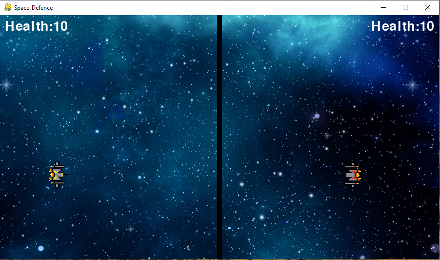
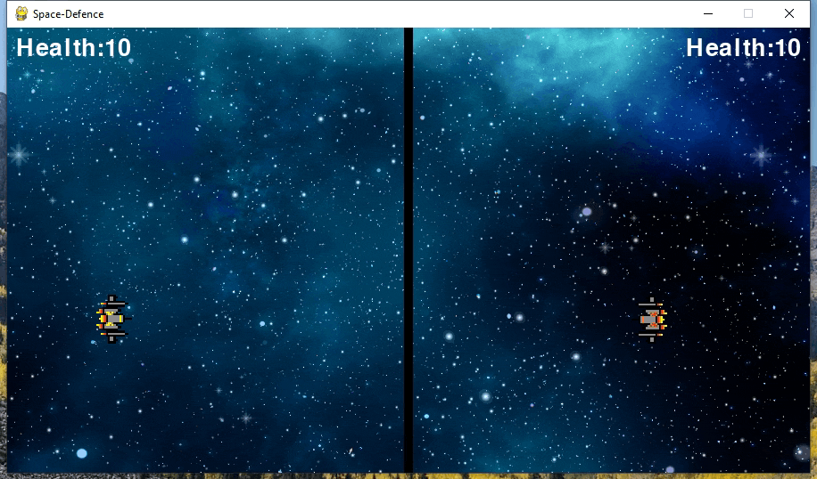

# Space-Defence

This is a 2-player game where each player commands a spaceship and shoots at the other player.

The winner is the first one to remove all the lives from the opponent.

## Table of Contents

- [Installation](#installation)
- [Usage](#usage)
- [Technologies](#technologies)
- [Contributing](#contributing)
- [License](#license)
- [Questions](#questions)

## Installation

Download the repo and run the following command `pip install pygame`, `python main.py`

## Usage

- Gif:

- Description:

As an user you are able to:

1. Control the Yellow spacship with the W,A,S,D keys and use the Left CTRL to fire

2. Control the Red spacship with the UP,DOWN,LEFT,RIGHT keys and use the Right CTRL to fire

3. View the Health of both Yellow and Red spaceship.

4. Hear sounds for both firing bullets and hitting the opponent.

5. See the winner at the end of the game

## Technologies

This application utilizes `python`, `pygame`.

## Contributing

When contributing to this repository, please first discuss the change you wish to make via issue, email, or any other method with the owners of this repository before making a change.

### Steps for contributing

1. Fork it!
2. Create your feature branch: `git checkout -b my-new-feature`
3. Commit your changes: `git commit -am 'Add some feature'`
4. Push to the branch: `git push origin my-new-feature`
5. Submit a pull request.

## License

## Questions

If you have any questions or concerns, feel free to contact me via:

GitHub: [anandlal1080](https://github.com/anandlal1080)
